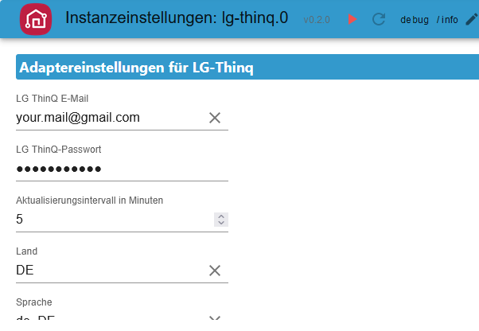
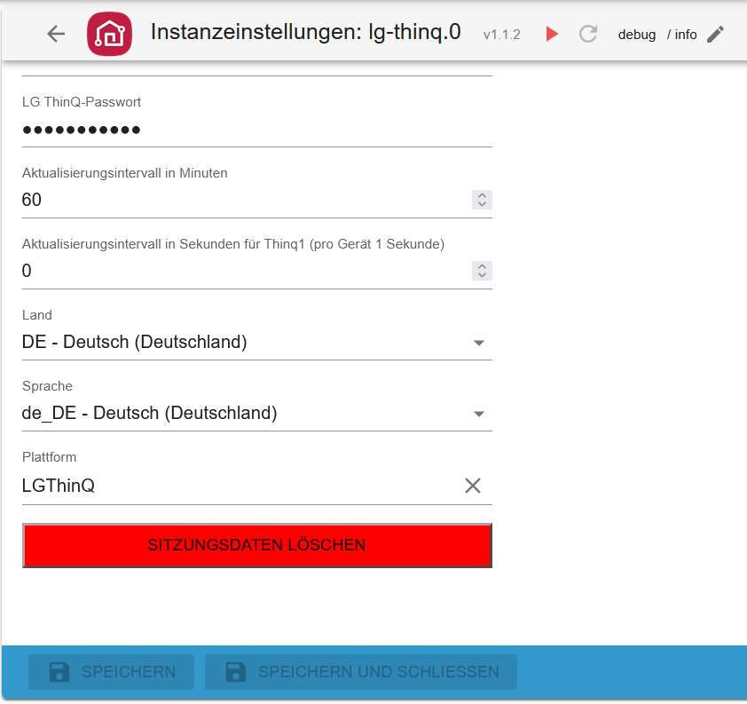
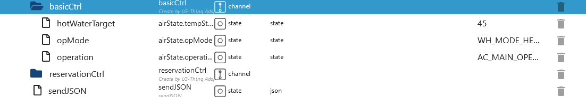

# ioBroker.lg-thinq

[Zurück zur README](/README.md)

# Zusammenfassung

-   [Instanz Einstellungen](#instanz-einstellungen)
    -   [Einstellung LG-Thinq](#instanz-einstellung-lg-thinq)
-   [Datenpunkte](#datenpunkte)
    -   [Datenpunkte Gerät 406 Wärmepumpe](#gerät-406-wärmepumpe)
        -   [Remote Statistik](#406-remote-statistic)
        -   [Remote Basis Befehle](#406-remote-basicctrl)
        -   [Remote Zeitplan](#406-remote-reservationctrl)
        -   [Snapshot](#406-snapshot)
    -   [Datenpunkte Gerät 401](#gerät-401)
    -   [Datenpunkte Gerät 101](#gerät-101)
    -   [Datenpunkte Gerät 201](#gerät-201)
    -   [Datenpunkte Gerät 202](#gerät-202)

# Instanz Einstellungen

### Instanz Einstellung LG-Thinq

[Zusammenfassung](#zusammenfassung)

-   `LG ThinQ E-Mail`: APP eMail eintragen
-   `LG ThinQ-Passwort`: APP Passwort eintragen
-   `Aktualisierungsintervall in Minuten`:  Empfohlen: Bei thinq2 60 Minuten und thinq1 0.5/1 Minute
-   `Land`: Land eingeben - Standard DE
-   `Sprache`: Sprache eingeben - Standard de_DE
-   `Plattform`: Plattform eingeben - Default LGThinQ
    
    

# Datenpunkte

### Gerät 406 Wärmepumpe

[Zusammenfassung](#zusammenfassung)

### Alle Ordner

### Remote Ordner

### 406 Remote Statistic

-   hourly
-   `remote.Statistic.command` Welche History soll geladen werden (Pollution JSON ist ein leer)
-   `remote.Statistic.endDate` Datum eintragen bei hourly muss end und start gleich sein Format: 2023.12.01
-   `remote.Statistic.startDate` Datum eintragen bei hourly muss end und start gleich sein Format: 2023.12.01
-   ODER daily
-   `remote.Statistic.endDate` Datum eintragen daily - Format: 2023.12.06
-   `remote.Statistic.startDate` Datum eintragen daily - Format: 2023.12.01
-   ODER monthly
-   `remote.Statistic.endDate` Datum eintragen monthly - Format: 2023.12.01
-   `remote.Statistic.startDate` Datum eintragen monthly - Format: 2023.10.01
-   `remote.Statistic.period` Welche Periode
-   `remote.Statistic.sendRequest` Auswahl senden
-   `remote.Statistic.jsonResult` Verbrauchsstatistik als JSON

    

### 406 Remote basicCtrl

[Zusammenfassung](#zusammenfassung)

-   `remote.basicCtrl.hotWaterTarget` Temperatur einstellen
-   `remote.basicCtrl.opMode` Modus einstellen

    

### 406 Remote reservationCtrl

[Zusammenfassung](#zusammenfassung)

-   `remote.reservationCtrl.add_new_schedule` Einen neuen Zeitplan anlegen. Es werden dann 3 neue Datenpunkte erstellt die ausgefüllt werden müssen. Danach `send_new_schedule` drücken um den neuen Slot zu speichern. Wird nicht gesendet, dann werden diese neuen Datenpunkte nach einem Restart gelöscht.
-   `remote.reservationCtrl.del_new_schedule` Einen Slot wieder löschen. Auch danach wieder `send_new_schedule` drücken damit die Daten gespeichert werden.
-   `remote.reservationCtrl.send_new_schedule` Drücken um Änderungen zu speichern.
-   `remote.reservationCtrl.01_end Enddatum` z. Bsp 22:30.
-   `remote.reservationCtrl.01_start Startdatum` z. Bsp 21:30.
-   `remote.reservationCtrl.01_state` Aktivieren/Deaktivieren

    

### 406 Snapshot

[Zusammenfassung](#zusammenfassung)

### Gerät 401

### Gerät 101

### Gerät 201

### Gerät 202